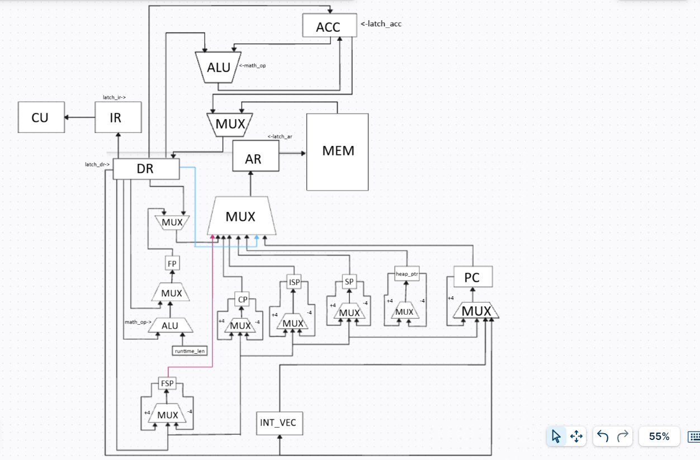
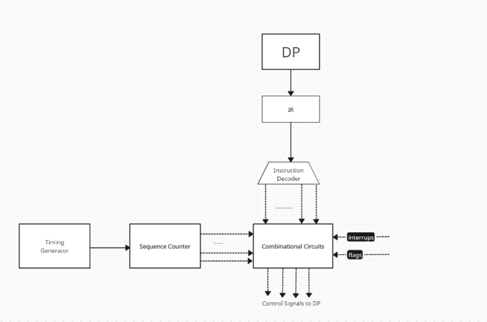

# Лабораторная работа №4
Выполнил: **Козьяков Арсений Дмитриевич (P3314)**
Преподаватель: **Пенской Александр Владимирович**
Вариант:  ```lisp | acc | neum | hw | tick | binary | trap | mem | pstr | prob2 | superscalar```
# Содержание
# Язык программирования
## Синтаксис
``` ebnf
<program>      ::= <expr>*
    
<expr>         ::= <integer>
                     | <string>
                     | <identifier>
                     | <list-expr>
    
<list-expr>    ::= "(" <operator> <expr>* ")"
                     | "(" "if" <expr> <expr> <expr>? ")"
                     | "(" "while" <expr> <expr>* ")"
                     | "(" "setq" <identifier> <expr> ")"
                     | "(" "defun" <identifier> "(" <identifier>* ")" <expr>* ")"
                     | "(" "progn" <expr>* ")"
                     | "(" "call" <identifier> <expr>* ")"     ; но любой (f a b) автоматически превращается в (call f a b)
                     | "(" "push" <expr>? ")"
                     | "(" "pop" <identifier>? ")"
                     | "(" "set-interrupt-vector" <identifier> ")"
                     | "(" "ei" ")"
                     | "(" "di" ")"
                     | "(" "read" ")"
                     | "(" "print" <expr> ")"
                     | "(" "out" <expr> ")"
                     | "(" "halt" ")"
                     | "(" "return" <expr>? ")"
                     | "(" ")"     ; пустой список допустим
    
<operator>     ::= "+" | "-" | "*" | "/"
                     | "=" | "!=" | "<" | "<=" | ">" | ">="
                     | any <identifier>
    
<integer>      ::= целочисленная константа
<string>       ::= '"' последовательность символов'"'
<identifier>   ::= любой непустой токен, не являющийся служебным выражением/числом/строкой
```
## Семантика
  **Стратегия вычисления**: строгая (eager) — перед применением операции сначала вычисляются все её операнды слева направо. \n
  
  **Нотация**: префиксная, т.е. форма (function a b ...) означает вызов function с аргументами a, b, ...
  
  **Типизация**: неявная.
  
  **Виды литералов**:
  
- Знаковые 32х битные числа
    
- Строки (pstr)
    
**Операции**:
- Арифметические операции: (+, -, *, /)
- Операции сравнения: (>, >=, =, !=, <, <=)
- (print arg): печатает значение ACC (если передан аргумент, он загружается в ACC и печатается) (print всегда печатает символы) если ACC указывает на pstr (length-prefixed string в пуле строк), то печатается строка символов;
- (read arg): читает слово из MMIO_IN и возвращает его в аккумулятор    
- (out arg): выводит слово из аккумулятора в MMIO_OUT (печатает младший байт ACC)    
- (alloc n): выделить n слов в куче    
- (aset base idx val): записать val в MEM[base + idx] (для работы с массивами).    
- (aget base idx) — прочитать MEM[base + idx] в ACC (для работы с массивами).    
- (defun function_name (args) <function body>) - определить функцию с именем function_name, с агрументами args и телом function body
    
- (setq var val) : объявить глобальную переменную с именем var и значением val
    
- (if <cond> <then-expr> <else-expr>?): Вычисляется выражение <cond>. Ненулевое значение считается true, ноль — false,Если <cond> ложно и есть <else-expr> — выполняется <else-expr> (его результат в ACC).Если <cond> ложно и <else-expr> отсутствует — if не выполняет ветвь.
        
- (while <cond> <body-expr1> <body-expr2> ...):Каждую итерацию вычисляется <cond>. Если он ненулевой — выполняется тело цикла (последовательность выражений). После тела повторяется проверка.Если <cond> равен 0 при проверке перед первой итерацией — тело не выполняется.Возвращаемое значение while в ACC: если цикл не выполнен ни разу — ACC будет равен значению cond (обычно 0); если цикл выполнялся — ACC будет содержать                результат последнего выражения, которое было выполнено в теле (результат последней команды тела).
        
- (progn <expr1> <expr2> ... <exprN>):progn вычисляет выражения слева направо.
Результат progn — значение последнего выражения exprN, помещённое в ACC.
Если progn пуст (нет выражений) — ACC не изменяется.
        
- (return): Если return встречается внутри тела функции (компилятор знает, что self.current_epilogue определён), то:компилируется expr (если есть) — результат в ACC,компилятор ставит JMP на заранее созданную метку эпилога функции (current_epilogue).Таким образом возврат идёт через общий эпилог, где выполняется LEAVE + RET. Это гарантирует корректное восстановление рамки стека.Если return используется не в функции (в глобальном контексте), current_epilogue == None и компилятор просто эмитит RET. В глобальном случае RET приведёт к завершению исполнения.

- (set-interrupt-vector handler): Устанавливает адрес обработчика прерывания (вектор). handler — имя функции в вашем коде. Компилятор эмитирует инструкцию SETVEC <addr>, где <addr> — байтовый адрес начала кода функции handler (относительно code_start).

- (ei): разрешает прерывания

- (di): запрещает прерывания

Примечание:
Пример работы out и print:
(print 65)    ;; выведет символы '6' '5' (печатает "65")
(out 65)      ;; выведет один байт с кодом 65 -> 'A'

# Организация памяти
**Адресация**: word-индексы (word = 4 байта).

```
low addresses (word 0)
+----------------------------------------------------------------+
| DATA (статические данные)                                      |
|  - зарезервированный string-pool (первые string_pool_cells)    |
|  - строковые литералы (pstr, заголовок len + символы как слова)|
|  - глобальные переменные (word per var, записаны через setq)   |
+----------------------------------------------------------------+
| CODE (инструкции)                                              |
|  - последовательные машинные слова (код программы)             |
|  - main (топ-уровень) затем функции (defun)                    |
+----------------------------------------------------------------+
| HEAP (куча) — выделяется ALLOC, растёт вверх (indices ↑)       |
|  - heap_ptr (в word-индексах) указывает на первый свободный    |
|    word после конца кода                                       |
+--------------------------- free gap ---------------------------+
| runtime_base (word index)  <-- граница: ниже — runtime stack   |
+----------------------------------------------------------------+
| RUNTIME STACK (логический стек, растёт вниз)                   |
|  phys: runtime_base-1, runtime_base-2, ...                     |
|  - аргументы, временные значения, локальные переменные         |
|  - управляется mem_push / mem_pop                              |
+----------------------------------------------------------------+
| INTERRUPT-STACK region (ISP area, растёт вниз)                 |
|  - хранит сохранённый контекст при входе в прерывание          |
+----------------------------------------------------------------+
| FRAME-STACK region (FSP area, растёт вниз)                     |
|  - хранит сохранённые старые значения FP (frame_push/pop)      |
+----------------------------------------------------------------+
| CALL-STACK region (CP area, растёт вниз)                       |
|  - хранит return addresses (PC как байтовый адрес)            |
+----------------------------------------------------------------+
high addresses (word mem_cells-1)
```
**runtime stack** — хранит значения: аргументы, локальные переменные, временные промежуточные значения.

**call stack** (стек возвратов) — хранит адреса возврата (return addresses) для инструкций CALL/RET.

**frame stack** — хранит предыдущие значения указателя кадра (старые FP) — помогает восстанавливать окружение при выходе из функции.

**interrupt stack** — хранит полный сохранённый контекст при прерывании (PC, ACC, FP, runtime_len, FSP, CP и т.п.), чтобы потом безопасно вернуться.

## Архитектура: Фон-Неймана (память данных и инструкций объединены)
## Размер машинного слова: 32 бита (4 байта).
**Хранение строк**: в виде pstr (Length-prefixed (Pascal string)). Память адресуется по машинным словам

## Регистры

- ACC — аккумулятор (32-битное signed значение). Основной регистр, в котором компилятор оставляет результаты выражений; есть инструкции чтения/записи ACC (LOAD_IMM, LOAD_MEM, LOAD_LOCAL, STORE_MEM, STORE_LOCAL и т.д.)

- PC — указатель исполнителя (в байтах).

- SP — физический указатель (word index) следующей свободной ячейки runtime-стека (runtime stack). Runtime-стек хранит значения (локальные переменные, временные, аргументы) и располагается в памяти так, что стек растёт вниз (к меньшим адресам).

- FP — логический frame pointer (см. ниже). Указывает базовую позицию (логический индекс) для текущего фрейма (откуда начинаются локальные переменные). FP — логический индекс внутри runtime-стека, а не физический адрес.

- FSP — физический указатель (word index) для вершины frame-stack. Frame-stack — отдельная область (вверху памяти) где хранятся сохранённые значения FP (т.е. цепочка старых FP при вложенных вызовах).

- CP — физический указатель (word index) для вершины call-stack (стек адресов возврата). Call-stack хранит адрес возврата (PC) для вызовов CALL. Call-stack также растёт вниз;

- SP — физический адрес (word index) следующей свободной ячейки runtime stack.

- FP — логический frame pointer (индекс в логическом runtime-стеке).

- FSP — физический указатель верхушки frame-stack.

- CP — физический указатель верхушки call-stack.

- ISP — физический указатель вершины interrupt-stack — отдельная область для сохранения контекста прерывания.

- heap_ptr - следующий адрес в куче

- interruption_vector - адрес обработчика прерывания внутри памяти

- in_interruption - флаг, показывающий внутри ли мы прерывания

- interruption_allowed -  флаг, показывающий разрешены ли прерывания в данный момент

- mmio_in/mmio_out - особые адреса, зарезервированные под MMIO (вход/выход)

- mmio_in_buffer - хранит очередь пришедших символов

- mmio_out_buffer - последовательность байтов, записанных в mmio_out

- output_buffer — вспомогательный массив, куда складывается вывод (используется для формирования stdout для тестов/CLI)

## Какие виды памяти и регистров доступны программисту?
- ACC (основной регистр для вычислений)
- PC (косвенно)
- доступ к памяти с помощью команд LOAD_MEM, STORE_MEM, LOAD_IND, STORE_IND, AGET/ASET и т.д;
- MMIO-порты: два специальных адреса (по умолчанию 0xFFF0 — mmio_in, 0xFFF1 — mmio_out).
- Стековые области в памяти: runtime stack, frame-stack, call-stack, interrupt-stack - Программист оперирует ими косвенно (через инструкции языка).
## Где хранятся статические и динамические данные?

**Статические данные** (константы, строковые литералы, глобальные переменные) - хранятся в DATA в начале памяти:

1) В начале DATA выделяется string_pool_cells слов для пулa строк (pstr). Компилятор сначала пытается размещать все pstr туда.

2) Далее компилятор добавляет глобальные переменные (по одному слову на переменную).

### Динамические данные:

**HEAP** — выделяется через ALLOC (операция выделяет size слов и возвращает base word index), растёт «вверх» (к большим индексам).

**Runtime stack** — динамический, управляется PUSH_IMM/POP и ENTER/LEAVE (через push_frame/pop_frame) и хранит локальные/временные/аргументы.

**Вспомогательные стековые области** — frame/call/interrupt stack — также в памяти, используются для управления вызовами/контекстом прерываний.

## Представление строк (pstr) и других литералов
### Работа с литералами
**Численные**: — 32-битное значение, поэтому литерал помещается целиком.

**Строковые литералы**: сохраняется в string-pool, в конец секции данных.
Cтроки хранятся как «length-prefixed Pascal-style»: в первой ячейке (word) записывается длина len, затем len слов — по одному символу (код символа в младшем байте слова). Т.е. строка занимает 1 + len машинных слов.

Размещение: Компилятор пытается поместить все pstr в зарезервированный пул (первые string_pool_cells слов). Строки размещаются последовательно: сначала header (len) в следующем свободном слове пула, затем символы — подряд.Если пул переполнен, компилятор размещает pstr в конце секции данных, также последовательно.
# Система команд
**Инструкции**: фиксированный размер INSTR_SIZE = 8 байт (2 слова). Формат инструкции — 64-бит little-endian: младшие 4 байта — аргумент (32-бит), старшие 4 байта — поле с opcode (в младших 8 битах старшего слова).

## Типы данных и представление

**Машинное слово**: 32-бит signed.

**Числа**: компилятор обычно генерирует LOAD_IMM <imm> для литералов.

**Строки**: Length-prefixed Pascal-style: первый word = len, потом len слов — по одному символу на слово (символ в младшем байте).

## Адресация и представление инструкций
    
- Адресация памяти: все адреса в командной системе принимаются как word indices (0..mem_cells-1);

- PC указывает на начало 8-байтовой инструкции.

- Инструкция (кодирование):

    - INSTR_SIZE = 8 байт.

    - arg при декоде интерпретируется как signed 32-bit (sign-extend) и далее используется как immediate / адрес как предписано командой.

    - opcode — младший байт старшего слова (0..255).

    - Патчинг меток (компилятор): компилятор emit сначала записывает encode_instr(op, 0) и запоминает позицию;
    позже _write_arg_at(pos, addr) перезаписывает первые 4 байта инструкции (аргумент) оставляя opcode неизменным.

## Режимы адресации
- Immediate — аргумент инструкции используется как значение (например, LOAD_IMM arg).

- Direct memory — аргумент интерпретируется как word-адрес (LOAD_MEM arg, STORE_MEM arg, JMP arg — байтовый адрес = code_start + arg).

- Indirect via stack — команды LOAD_IND/STORE_IND берут адрес со стека, затем читают/пишут по этому адресу.

- Local addressing — LOAD_LOCAL idx / STORE_LOCAL idx обращаются к FP + idx (логический индекс в runtime-стеке) и через _phys_addr_for_logical_index транслируются в физический word-адрес.

## Ввод-вывод
- MMIO: по умолчанию mmio_in = 0xFFF0, mmio_out = 0xFFF1 (config). Эти адреса доступны как обычные LOAD_MEM/STORE_MEM.

- STORE_MEM(mmio_out, value) — добавляет value & 0xFF в mmio_out_buffer и output_buffer, обновляет pstr в памяти по адресу mmio_out.

- STORE_MEM(mmio_in, v!=0) — добавляет входной символ в mmio_in_buffer; STORE_MEM(mmio_in, 0) — потребляет (pop) один символ.

- READ — чтение mmio_in: берёт первый байт из mmio_in_buffer (или 0).

### Прерывания:

- Ввод моделируется как событие (по расписанию). При событии символа вызывается mem_write_word(mmio_in, ord(ch)) и помечает last_interrupt_source="IN". Затем CU вызывает handle_interrupt() (если interruption_allowed).

- handle_interrupt() сохраняет компактный контекст на interrupt-stack (ISP): порядок push: CP, FSP, runtime_len, FP, ACC, PC. Затем устанавливает in_interruption = True и PC  = code_start + interruption_vector.

- Обработчик прерывания — обычный код/процедура, написанный Lisp (компилируется в CODE); возврат осуществляется IRET — при IRET/восстановлении читаются значения обратно и in_interruption=False.

- Прерывания внутренние.

- Разрешение вложенных прерываний управляется interruption_allowed & инструкциями EI/DI. При входе в обработчик VM временно запрещает прерывания, чтобы корректно сохранить контекст; потом обработчик может явно разрешить вложенность EI
    
### Таблица команд
```
| Opcode (такты)| Имя         | Семантика                                                                                       | Примечание                          |
|---------------|-------------|-------------------------------------------------------------------------------------------------|-------------------------------------|
| 0     (1)     | NOP         | ничего не делает                                                                                | пустая инструкция                   |
| 1     (1)     | HALT        | завершение выполнения                                                                           | останавливает VM                    |
| 10    (1)     | LOAD_IMM    | `ACC = arg`                                                                                     | immediate → ACC                     |
| 11    (1)     | ADD_IMM     | `ACC = ACC + arg`                                                                               | арифметика над ACC                  |
| 12    (1)     | SUB_IMM     | `ACC = ACC - arg`                                                                               |                                     |
| 13    (4)     | MUL_IMM     | `ACC = ACC * arg`                                                                               | умножение                           |
| 14    (8)     | DIV_IMM     | `ACC = ACC / arg` (если arg==0 → 0)                                                             | деление                             |
| 20    (1)     | LOAD_CONST  | `ACC = arg` (адрес константы/литерала в словах)                                                 | компилятор кладёт pstr как addr     |
| 21    (3)     | LOAD_MEM    | `ACC = MEM[arg]`                                                                                | чтение слова по word-адресу         |
| 22    (3)     | STORE_MEM   | `MEM[arg] = ACC`                                                                                | запись в память                     |
| 23    (4)     | STORE_IND   | `addr = pop(); MEM[addr] = ACC`                                                                 | индекс берётся со стека             |
| 24    (4)     | LOAD_IND    | `addr = pop(); ACC = MEM[addr]`                                                                 | индиректная загрузка                |
| 30    (2)     | JMP         | `PC = code_start + arg`                                                                         | безусловный переход                 |
| 31    (2)     | BEQZ        | `if ACC == 0: PC = code_start + arg`                                                            | ветвление по нулю                   |
| 32    (2)     | BNEZ        | `if ACC != 0: PC = code_start + arg`                                                            | ветвление по не-нолю                |
| 40    (4)     | CALL        | `call_push(PC); PC = code_start + arg`                                                          | push return addr в call-stack       |
| 41    (4)     | RET         | вернуть из функции                                                                              | pop return addr из call-stack;      |
| 50    (1)     | SETVEC      | `interruption_vector = code_start + arg`                                                        | задать адрес обработчика прерывания |
| 51    (1)     | EI          | `interruption_allowed = True`                                                                   | разрешить прерывания                |
| 52    (1)     | DI          | `interruption_allowed = False`                                                                  | запретить прерывания                |
| 53    (6)     | IRET        | восстановить полный контекст из interrupt-stack (ISP) (PC/ACC/FP/runtime_len/FSP/CP)            | возврат из прерывания               |
| 54    (2)     | SOFTINT     | программное прерывание: пометить источник и вызвать handler                                     | внутреннее прерывание               |
| 60    (3)     | PUSH_IMM    | `mem_push(ACC)`                                                                                 | записать ACC в runtime-stack        |
| 61    (3)     | POP         | `ACC = mem_pop()`                                                                               | извлечь слово со стекa в ACC        |
| 70  (5 + n)   | PRINT       | печать ACC                                                                                      | вывод через mmio_out                |
| 71    (3)     | READ        | `ACC = mmio_in_cell`                                                                            | чтение символа из mmio_in           |
| 80    (3)     | LOAD_LOCAL  | `ACC = frame_local_or_arg[arg]`                                                                 | доступ к локальному слоту           |
| 81    (4)     | STORE_LOCAL | `frame_local_or_arg[arg] = ACC`                                                                 | взять локальное значение            |
| 82    (6)     | ENTER       | установить новый фрейм, сохраняет старый                                                        |  выделяет слоты локалей             |
| 83    (4)     | LEAVE       | удалить текущий фрейм                                                                           | восстанавливает FP из frame-stack   |
| 84    (10)    | ALLOC       | выделить arg слов (если arg==0 → взять размер из ACC)                                           | возвращает base (word-addr) в ACC;  |
| 85    (6)     | ASET        | array set: если arg!=0 → base=arg, idx=pop(); иначе → idx=pop(); base=pop(); MEM[base+idx]=ACC  | запись в массив по базовому адресу  |
| 86    (5)     | AGET        | array get: аналогично ASET, но `ACC = MEM[base+idx]`                                            | чтение из массива                   |
| 90    (4)     | BINOP_POP   | `ACC = mem_pop() <op> ACC` (arg : 1=ADD,2=SUB,3=MUL,4=DIV)                                      | бинарная операция с поп-операндом   |
| 91    (4)     | CMP_POP     | `ACC = cond(mem_pop, ACC) ? 1 : 0` (arg: 1==,2!=,3<,4<=,5>,6>=)                                 | сравнение с поп-операндом           |
```
# Транслятор
[parser.py](parser.py)

**Назначение**: прочитать исходный файл на Lisp-подобном языке, построить AST, сгенерировать машинный код (бинарный файл) и секцию данных.
## Интерфейс командной строки
```bash
usage: parser.py <input.lisp> [-o OUT] [--data DATA] [--string-pool-cells N] [--debug]
```

параметры:

- input: исходный файл с программой 
- -o, --out: путь к выходному бинарному файлу (по умолчанию input + .bin)
- --data: путь к выходному файлу с секцией данных (по умолчанию out.bin.data)
- --string-pool-cells: количество слов, заранее резервируемых для пула строк (word = machine word)
- --debug: при включении дополнительно запишется out.hex с шестнадцатеричной трансляцией + мнемониками
## Принципы работы транслятора — этапы

Транслятор работает в несколько последовательных этапов:

1) **Чтение исходника**: Файл считывается как UTF-8 байтовая строка.

2) **Токенизация**: Регулярным выражением выделяются токены: ( ) числа, идентификаторы, строки в двойных кавычках, комментарии (; …) игнорируются. Результат — плоский список токенов.

3) **Парсинг в AST**:
Поток токенов преобразуется в древовидное представление (AST). Синтаксические правила:

    - Списки — между ( и ).

    - Числа → int.

    - Строковые литералы → кортеж ("str", <python str>).

    - Атомы/идентификаторы → строки.
    - Ошибки синтаксиса (незакрытые/лишние скобки) приводят к SyntaxError.

4) **Создание объекта Compiler**:
    - В него передаётся AST и опции (например, string_pool_cells). Compiler содержит внутренние буферы code: bytearray() и data: bytearray() и вспомогательные структуры (labels, patch и т.п.).

    - Резервирование пула строк
    В data заранее выделяется string_pool_cells * word_size байт (в парсере — word = 4 байта). Строки будут размещаться в этом пуле первым вариантом, если хватает места.

5)  **Компиляция**

    - _compile_main() — транслирует все верхнеуровневые выражения, которые не defun, затем эмитит HALT.

    - _compile_defuns() — затем транслируются все defun-формы, при этом метки функций (labels[name]) фиксируются в момент начала генерации кода для функции.

    - _patch_labels() — после генерации кода все позиции, где был отложен аргумент (операции JMP, CALL, SETVEC и т.п.) патчатся реальными адресами: patch хранит пары (pos, label); _write_arg_at записывает 32-битный аргумент по байтовой позиции в коде, сохраняя байты с opcode.

    - Запись файлов: после удачной компиляции байты code и data записываются в указанные файлы.
# Модель процессора
[processor.py](processor.py)

**Назначение**: прочитать .lisp файл (или .bin) и исполнить его (использует модуль parser.py)

### Интерфейс командной строки
``` bash
python processor.py <program> [--config CONFIG] [--input-schedule SCHEDFILE] [--debug] [--logfile FILE] [--console]
```

параметры:
- -program - имя входного файла  (.bin или можно сразу .lisp)
- --config CONFIG - путь к .yaml кофигу
- --input-schedule - путь к расписанию ввода
- --debug - включает логирование
- --logfile  - путь для файла логирования
- --console - дублирует лог в stdout

### Datapath

Сигналы:
- `latch_ + name` - защелкнуть значение
- `math_op` - выполнить простую математическую операцию (сложение, умножение, вычитание, деление)
- `mem_write, mem_read` - запись и чтение в память
- `int_req` - запрос на прерывания
- `sel` - выбрать соответствующий вход мультиалексора
- `flags` - передать флаги в CU
Реализован в классе Datapath
### ControlUnit

Сигналы:
- `latch_ + name` - защелкнуть значение
- `math_op` - выполнить простую математическую операцию (сложение, умножение, вычитание, деление)
- `sel` - выбрать соответствующий вход мультиалексора
Реализован в классе ControlUnit
# Тестирование
[./golden/add64.yaml](./golden/cat.yaml) - сложение 64битных чисел

[./golden/cat.yaml](./golden/cat.yaml) - печатать данные, поданные через ввод.

[./golden/difference_100.yaml](./golden/difference_100.yaml) - реализация алгоритма по варианту (разность суммы квадратов и квадрата суммы первых ста чисел)

[./golden/fib.yaml](./golden/fib.yaml) - проверка работы рекурсивной функции (числа Фибоначчи)

[./golden/hello_user_name.yaml]([./golden/hello_user_name.yaml) - запросить у пользователя его имя, считать его, вывести на экран приветствие

[./golden/hello_world.yaml]([./golden/hello_world.yaml) - вывести "Hello, World!"
[./golden/pause_test.yaml](./golden/pause_test.yaml) - проверка возможности остановки процессора на любом тике

[./golden/sort.yaml](./golden/sort.yaml) - пользователь загружает в систему список чисел и программа выводит их в отсортированном формате;

[./golden/statement.yaml](./golden/statement.yaml) - проверка некоторых выражений
